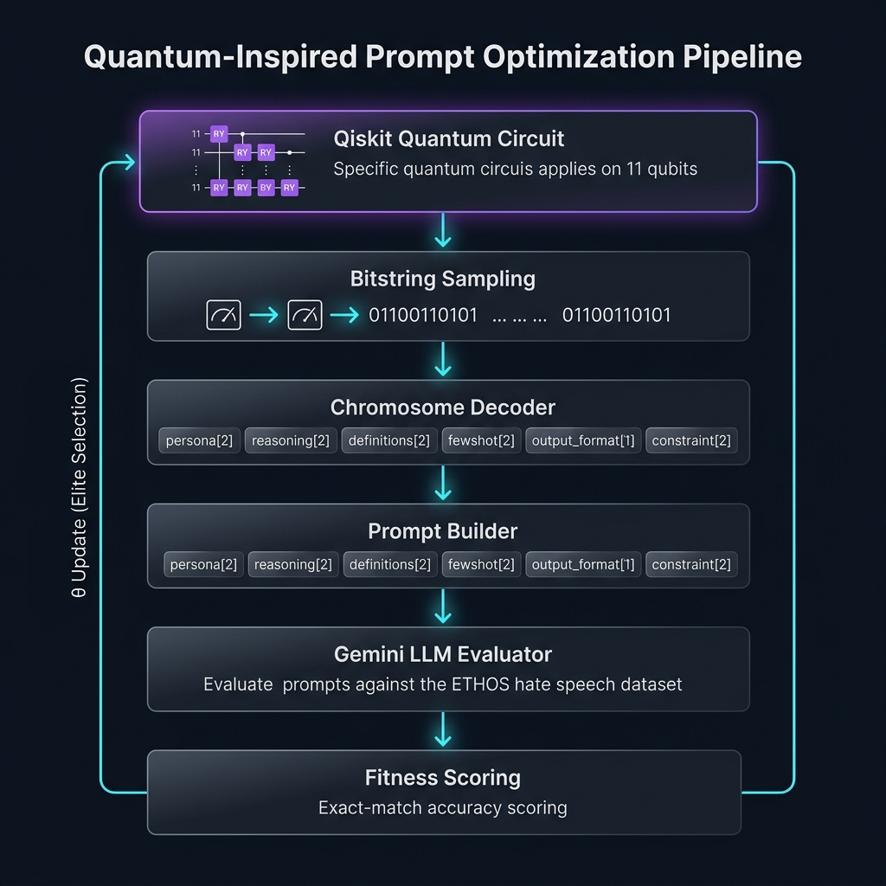
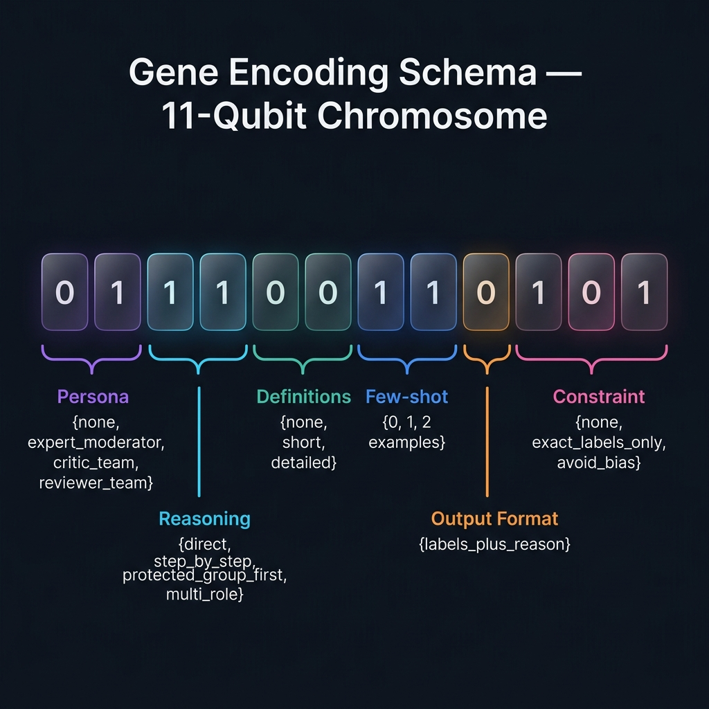
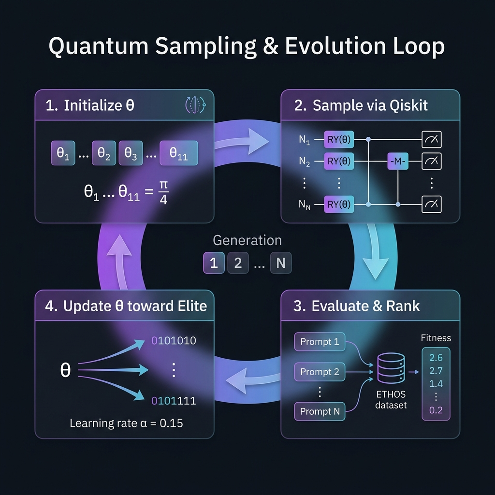

<div align="center">

# ⚛️ Quantum-Inspired Prompt Optimization (Q-GAAPO)

### A Quantum-Enhanced Genetic Algorithm for Automatic Prompt Engineering on Hate Speech Detection

[](https://www.python.org/)
[](https://qiskit.org/)
[](https://ai.google.dev/)
[](LICENSE)

---

**This is a base/prototype implementation using smaller datasets for demonstration purposes.**  
The system uses the **ETHOS multilabel hate speech dataset** and **Google Gemini** as the LLM evaluator.

[📄 Base Paper](#-base-paper--inspiration) · [🏗️ Architecture](#️-system-architecture) · [🚀 Quick Start](#-quick-start) · [⚙️ Configuration](#️-configuration--customization)

</div>

---

## 📋 Table of Contents

- [Overview](#-overview)
- [Base Paper & Inspiration](#-base-paper--inspiration)
- [Key Innovation](#-key-innovation--novelty)
- [System Architecture](#️-system-architecture)
- [Pipeline Deep-Dive](#-pipeline-deep-dive)
  - [Stage 1 — Quantum Sampling](#stage-1--quantum-sampling-quantum_samplerpy)
  - [Stage 2 — Chromosome Decoding](#stage-2--chromosome-decoding-decoderpy)
  - [Stage 3 — Prompt Construction](#stage-3--prompt-construction-prompt_builderpy)
  - [Stage 4 — LLM Evaluation](#stage-4--llm-evaluation-evaluatorpy)
  - [Stage 5 — Evolutionary Update](#stage-5--evolutionary-update--selection)
- [Gene Encoding Schema](#-gene-encoding-schema)
- [Evolution Loop](#-evolution-loop)
- [Dataset — ETHOS Multilabel](#-dataset--ethos-multilabel)
- [Quick Start](#-quick-start)
- [Configuration & Customization](#️-configuration--customization)
- [Project Structure](#-project-structure)
- [Results & Interpretation](#-results--interpretation)
- [Limitations & Future Work](#️-limitations--future-work)
- [References](#-references)

---

## 🧬 Overview

**Q-GAAPO** (Quantum-Inspired Genetic Algorithm Applied to Prompt Optimization) is a prototype system that combines **quantum computing principles** with **genetic algorithm strategies** to automatically discover optimal prompts for Large Language Models (LLMs).

Instead of relying on manual prompt engineering or expensive LLM-based prompt rewriting (like APO or OPRO), this system:

1. **Encodes prompt structure as a binary chromosome** — each prompt configuration maps to an 11-bit string
2. **Uses a Qiskit quantum circuit** to sample candidate chromosomes via parameterized rotation gates
3. **Decodes bitstrings into structured prompts** with discrete genes (persona, reasoning style, etc.)
4. **Evaluates prompts** against real hate speech data using Google Gemini
5. **Evolves rotation angles** toward elite candidates across generations

> **💡 Core Insight:** By converting prompt optimization from a free-text evolution problem into a *structured gene-based search problem*, we make it compatible with quantum-inspired search while drastically reducing the number of expensive LLM-based prompt rewrites.

---

## 📄 Base Paper & Inspiration

This project draws direct inspiration from the following published research:

> **GAAPO: Genetic Algorithm Applied to Prompt Optimization**  
> Xavier Sécheresse, Jacques-Yves Guilbert–Ly, Antoine Villedieu de Torcy  
> *Frontiers in Artificial Intelligence*, Volume 8, 2025  
> DOI: [10.3389/frai.2025.1613007](https://doi.org/10.3389/frai.2025.1613007)  
> 🔗 [Read Full Paper](https://www.frontiersin.org/journals/artificial-intelligence/articles/10.3389/frai.2025.1613007/full)

### What the Paper Proposes

The GAAPO paper introduces a **hybrid genetic optimization framework** that evolves LLM prompts through successive generations. It integrates five prompt generation strategies within a single evolutionary cycle:

| Strategy | Type | Description |
|:---------|:-----|:------------|
| **OPRO** | Forced Evolution | Trajectory-based optimization using prompt history |
| **APO/ProTeGi** | Forced Evolution | Error-gradient-driven prompt refinement |
| **Random Mutator** | Random Evolution | 8 distinct mutation strategies (persona injection, task decomposition, etc.) |
| **Crossover** | Random Evolution | Split-and-merge recombination of parent prompts |
| **Few-shot** | In-Context Learning | Augmenting prompts with labeled examples |

The paper demonstrates GAAPO across ETHOS (hate speech), MMLU-Pro (engineering & business), and GPQA (physics) datasets. It operates in three phases per generation:

```
Generation Phase  →  Evaluation Phase  →  Selection Phase
  (create new         (score on             (keep best
   candidates)         validation)            as parents)
```

### How This Project Extends It

Our prototype takes GAAPO's core principle — **structured prompt representation** — and adds a **quantum-inspired sampling layer**:

- **GAAPO** uses LLM-based generators (OPRO, APO, mutators) → expensive, many API calls
- **Q-GAAPO** uses a **Qiskit quantum circuit** to sample prompt structures → cheap, no LLM calls for generation
- The LLM (Gemini) is used **only for evaluation**, not for prompt creation

This makes the system significantly more cost-effective for resource-constrained scenarios.

---

## 🔬 Key Innovation & Novelty

```
┌─────────────────────────────────────────────────────────────────┐
│                     TRADITIONAL APPROACH                        │
│  Free-text prompt → LLM rewrites → LLM evaluates → repeat     │
│  ($$$ expensive: LLM calls for BOTH generation AND evaluation) │
└─────────────────────────────────────────────────────────────────┘
                              ↓ vs ↓
┌─────────────────────────────────────────────────────────────────┐
│                     OUR APPROACH (Q-GAAPO)                      │
│  Quantum circuit → Bitstring → Decoder → Structured Prompt     │
│  → LLM evaluates only → θ update → repeat                     │
│  ($ cheap: LLM calls ONLY for evaluation)                      │
└─────────────────────────────────────────────────────────────────┘
```

**The novelty lies in converting prompt optimization from free-text evolution into a structured gene-based search problem.** This makes it:

- ✅ Compatible with quantum-inspired search (Qiskit circuit sampling)
- ✅ Drastically cheaper (no LLM calls for prompt generation)
- ✅ Reproducible (deterministic decoding from bitstrings)
- ✅ Interpretable (each gene maps to a specific prompt design decision)

---

## 🏗️ System Architecture

<div align="center">



*End-to-end pipeline: from quantum circuit to optimized prompts*

</div>

The system consists of **five core modules** that form a closed evolutionary loop


## 🔍 Pipeline Deep-Dive

### Stage 1 — Quantum Sampling (`quantum_sampler.py`)

The quantum layer uses an **11-qubit parameterized circuit** to generate candidate prompt configurations.

**How it works:**

1. Each qubit gets a **RY(θᵢ) rotation gate** controlling the probability of measuring `|0⟩` vs `|1⟩`
2. All 11 qubits are measured simultaneously, producing an 11-bit string
3. Multiple shots produce a **distribution** of bitstrings weighted by the θ parameters

```python
# Simplified circuit construction
qc = QuantumCircuit(11, 11)
for i, angle in enumerate(theta):
    qc.ry(angle, i)        # RY rotation — controls 0/1 probability
qc.measure(range(11), range(11))
```

**Initial state:** All θ values start at **π/4** (equal probability of 0 and 1), ensuring maximum exploration in the first generation.

**Update rule:** After each generation, θ values shift toward the elite bitstring:
- If the elite has `1` at position *i* → increase θᵢ (bias toward `1`)
- If the elite has `0` at position *i* → decrease θᵢ (bias toward `0`)
- Learning rate: **α = 0.15**, clamped to `[0.05, π − 0.05]`

---

### Stage 2 — Chromosome Decoding (`decoder.py`)

Each 11-bit string is decoded into a **chromosome** — a dictionary of six discrete genes:

<div align="center">



*11-qubit chromosome layout: each bit segment maps to a prompt design gene*

</div>

```
Bitstring:  0  1  1  0  0  1  1  0  1  0  1
            ├──┤  ├──┤  ├──┤  ├──┤  │  ├──┤
           Persona Reasoning Defs  Few  Out Constraint
            (2b)   (2b)     (2b)  (2b) (1b)  (2b)
```

The decoder maps each bit segment to a concrete prompt configuration option. See the [Gene Encoding Schema](#-gene-encoding-schema) section for the full mapping table.

---

### Stage 3 — Prompt Construction (`prompt_builder.py`)

The prompt builder takes a decoded chromosome and assembles a **structured natural language prompt** by concatenating sections:

```
[Persona]       → "You are an expert content moderator."
[Reasoning]     → "Analyze the message step by step..."
[Label List]    → "The possible labels are: violence, gender, race..."
[Definitions]   → Short or detailed category definitions
[Constraint]    → "Use only labels from the given label set..."
[Few-shot]      → 0-2 labeled examples from training data
[Output Format] → "Output only the final labels as a comma-separated list."
[Task]          → "Now classify the following message: {user_message}"
```

This modular design means every prompt variant is **deterministically reproducible** from its bitstring.

---

### Stage 4 — LLM Evaluation (`evaluator.py`)

Each candidate prompt is evaluated against the ETHOS validation set using **Google Gemini** (`gemini-2.5-flash-lite`):

1. The `{user_message}` placeholder is filled with each validation example
2. Gemini generates a response (predicted hate speech labels)
3. The response is parsed into a label set
4. **Exact-match accuracy** is computed: prediction is correct *only if* the full predicted label set exactly matches the true label set

```
Scoring:  accuracy = 1  if  predicted_labels == true_labels (as sets)
          accuracy = 0  otherwise
```

Additionally, **extra labels** (false positives) and **missing labels** (false negatives) are tracked for detailed analysis.

> **⚠️ Rate Limiting:** The evaluator includes a 13-second delay between API calls and automatic retry logic with 25-second backoff to respect Gemini free-tier limits.

---

### Stage 5 — Evolutionary Update & Selection

After evaluation, the system:

1. **Ranks candidates** by: `(avg_score ↑, avg_extra ↓, avg_missing ↓)`
2. **Selects the elite** (best-performing candidate)
3. **Updates θ** using the elite's bitstring to bias future sampling
4. **Records history** for tracking evolution progress

The loop repeats for `n_generations` (default: 2 in this prototype).

---

## 🧬 Gene Encoding Schema

The 11-qubit chromosome encodes **six prompt design dimensions**:

| Gene | Bits | Options | Description |
|:-----|:----:|:--------|:------------|
| **Persona** | `[0:2]` | `none` · `expert_moderator` · `critic_team` · `reviewer_team` | Role/identity assigned to the LLM |
| **Reasoning** | `[2:4]` | `direct` · `step_by_step` · `protected_group_first` · `multi_role` | Analytical strategy for classification |
| **Definitions** | `[4:6]` | `none` · `short` · `detailed` | Level of hate speech category definitions provided |
| **Few-shot** | `[6:8]` | `0` · `1` · `2` | Number of labeled examples included in prompt |
| **Output Format** | `[8]` | `labels_only` · `labels_plus_reason` | Whether to include reasoning in output |
| **Constraint** | `[9:11]` | `none` · `exact_labels_only` · `avoid_bias` | Guardrails on the classification behavior |

**Total search space:** 4 × 4 × 3 × 3 × 2 × 3 = **864 unique prompt configurations**

> The quantum circuit efficiently explores this discrete combinatorial space without enumerating all candidates.

---

## 🔄 Evolution Loop

<div align="center">



*Iterative quantum sampling and evolutionary optimization cycle*

</div>

```
Generation 1:
  θ = [π/4, π/4, ..., π/4]  ← uniform exploration
  ↓
  Sample 20 bitstrings via Qiskit (20 shots)
  ↓
  Decode → Build prompts → Filter (labels_only format)
  ↓
  Evaluate top candidates on validation set via Gemini
  ↓
  Select elite → Update θ (α = 0.15)

Generation 2:
  θ = [updated values]  ← biased toward previous elite
  ↓
  ... repeat ...

Final:
  Compare baseline prompt vs. best-found prompt
  Report improvements
```

---

## 📊 Dataset — ETHOS Multilabel

The system uses the **ETHOS** (Ethics in Text — Hate and Offensive Speech) multilabel dataset by [Mollas et al., 2022](https://huggingface.co/datasets/iamollas/ethos).

### Dataset Splits (Reduced for Prototype)

| Split | Size | Purpose |
|:------|:----:|:--------|
| **Training** | 10 samples | Few-shot examples for prompt construction |
| **Validation** | 10 samples | Fitness evaluation during evolution |
| **Test** | 20 samples | Final comparison (baseline vs. best) |

### Classification Categories

The 8 hate speech dimensions classified:

| Category | Description |
|:---------|:------------|
| `violence` | Content encouraging or referring to physical harm |
| `directed_vs_generalized` | Whether hate targets a specific individual or a group |
| `gender` | Offensive content targeting gender |
| `race` | Offensive content targeting race |
| `national_origin` | Offensive content targeting nationality |
| `disability` | Offensive content targeting disability |
| `religion` | Offensive content targeting religion |
| `sexual_orientation` | Offensive content targeting sexual orientation |

> **⚠️ Important:** This is a **base implementation with very small data splits** (10/10/20). The original GAAPO paper uses 50/50/200 splits. Dataset sizes can be easily scaled up — see [Configuration](#️-configuration--customization).

---

## 🚀 Quick Start

### Prerequisites

- **Python 3.10+**
- A **Google Gemini API key** ([Get one free here](https://aistudio.google.com/apikey))

### Step 1 — Clone & Install Dependencies

```bash
git clone https://github.com/your-username/quantum_gaapo_ethos.git
cd quantum_gaapo_ethos
```

Install required packages:

```bash
pip install numpy qiskit qiskit-aer google-genai datasets
```

> **Note on `datasets` package:** If you need to regenerate the ETHOS data splits from Hugging Face, pin `datasets==2.16.0` for compatibility with legacy loading scripts. The pre-generated JSON files in `data/` should work without this constraint.

### Step 2 — Set Your Gemini API Key

> **🔑 CRITICAL: You must set your Gemini API key as an environment variable before running the system.**

**Windows (PowerShell):**
```powershell
$env:GEMINI_API_KEY = "your-api-key-here"
```


### Step 3 — Run the Optimization

```bash
cd src
python main.py
```

### What to Expect

The system will:

1. **Evaluate a baseline (bad) prompt** — minimal configuration with no persona, no definitions, no examples
2. **Run 2 generations** of quantum-assisted evolution
3. **Print detailed results** for each candidate in each generation
4. **Show the best prompt found** across all generations
5. **Compare baseline vs. best** on the validation set

**Expected runtime:** ~5–10 minutes (depends on Gemini API rate limits)

**Sample output structure:**
```
####################################
BASELINE BAD PROMPT
####################################
Chromosome: {'persona': 'none', 'reasoning': 'direct', ...}
Average Score: 0.0
...

####################################
GENERATION 1
####################################
Evaluating 2 candidates...

CANDIDATE 1
Bitstring: 01100110101
Chromosome: {'persona': 'expert_moderator', 'reasoning': 'step_by_step', ...}
Average Score: 0.5
...

====================================
BEST PROMPT FOUND OVER ALL GENERATIONS
====================================
...
```

### Optional — Regenerate Dataset Splits

If you want to create fresh data splits from Hugging Face:

```bash
pip install datasets==2.16.0
cd src
python load_ethos.py
```

This will regenerate `data/ethos_train.json`, `data/ethos_val.json`, and `data/ethos_test.json`.

---

## ⚙️ Configuration & Customization

### Scaling the Dataset

In `src/load_ethos.py`, modify the `make_small_split()` function:

```python
def make_small_split(data, seed=42):
    random.seed(seed)
    data_copy = data[:]
    random.shuffle(data_copy)

    # ── Change these values to scale up ──
    train = data_copy[:10]       # Increase for more few-shot examples
    val = data_copy[10:20]       # Increase for more robust evaluation
    test = data_copy[20:40]      # Increase for more reliable testing

    return train, val, test
```

**Recommended splits for full experiments (matching the GAAPO paper):**

```python
train = data_copy[:50]       # 50 training samples
val = data_copy[50:100]      # 50 validation samples
test = data_copy[100:300]    # 200 test samples
```

### Tuning Evolution Parameters

In `src/main.py`:

```python
N_QUBITS = 11                 # Fixed (matches gene encoding)
n_generations = 2              # Increase for deeper optimization (paper uses 10-25)

# In generate_prompt_candidates():
shots = 20                     # More shots = more candidate diversity
max_candidates = 10            # Maximum unique candidates per generation

# In evaluate_candidates():
subset_size = 2                # Number of validation samples per evaluation

# In update_theta():
learning_rate = 0.15           # Controls exploration vs exploitation
```

### Changing the LLM Model

In `src/evaluator.py`, modify the model name:

```python
def call_llm(prompt_text, model_name="gemini-2.5-flash-lite", max_retries=3):
    # Change model_name to any supported Gemini model:
    # - "gemini-2.5-flash-lite" (default, fastest, free tier friendly)
    # - "gemini-2.0-flash"
    # - "gemini-1.5-pro"
```

### Adding New Genes

To expand the search space, modify:

1. **`prompt_schema.py`** — Add new gene options
2. **`decoder.py`** — Add new bit-to-value mapping
3. **`prompt_builder.py`** — Add prompt section logic for the new gene
4. **`quantum_sampler.py` & `main.py`** — Update `N_QUBITS` to match new total bit count

---

## 📂 Project Structure

```
quantum_gaapo_ethos/
│
├── 📁 assets/                      # Diagrams and images for README
│   ├── pipeline_architecture.png
│   ├── gene_encoding.png
│   └── evolution_loop.png
│
├── 📁 data/                        # Pre-generated dataset splits
│   ├── ethos_train.json            # 10 training examples (few-shot pool)
│   ├── ethos_val.json              # 10 validation examples (fitness eval)
│   └── ethos_test.json             # 20 test examples (final comparison)
│
├── 📁 results/                     # Output directory (empty initially)
│
├── 📁 src/                         # Source code
│   ├── main.py                     # 🚀 Entry point — runs the full evolution loop
│   ├── quantum_sampler.py          # 🔮 Qiskit circuit builder & bitstring sampler
│   ├── decoder.py                  # 🧬 Bitstring-to-chromosome decoder
│   ├── prompt_schema.py            # 📋 Gene schema definition
│   ├── prompt_builder.py           # 📝 Chromosome-to-prompt assembler
│   ├── evaluator.py                # 🤖 Gemini API caller & fitness scorer
│   └── load_ethos.py               # 📊 ETHOS dataset loader & splitter
│
├── notes.md                        # Development notes
└── README.md                       # You are here
```

---

## 📈 Results & Interpretation

### What the System Measures

| Metric | Description |
|:-------|:------------|
| **avg_score** | Exact-match accuracy (1.0 = all labels perfectly predicted) |
| **avg_extra** | Average false-positive labels per sample |
| **avg_missing** | Average false-negative labels per sample |

### Ranking Logic

Candidates are ranked by the tuple: **(score ↑, extra ↓, missing ↓)**

This prioritizes accuracy first, then penalizes over-prediction, then under-prediction.

### Expected Behavior

- **Generation 1:** Broad exploration — diverse bitstrings sampled uniformly
- **Generation 2:** Focused exploitation — θ biased toward elite patterns
- **Best prompts** typically feature: a defined persona, step-by-step reasoning, and exact label constraints
- **Baseline prompt** (no persona, direct reasoning, no definitions) usually scores poorly

> **Note:** Due to the small validation set (2 samples per evaluation) and LLM response variability, scores may fluctuate between runs. This is expected behavior for a prototype. Scaling up the `subset_size` and dataset splits will produce more stable results.

---

## ⚠️ Limitations & Future Work

### Current Prototype Limitations

| Limitation | Detail |
|:-----------|:-------|
| **Small dataset** | Only 10/10/20 train/val/test split (vs. 50/50/200 in the paper)          |
| **2 generations** | Paper recommends 10–25 generations for convergence                       |
| **Single evaluation** | Each prompt is tested on only 2 validation samples                   |
| **No APO / OPRO** | This version uses quantum sampling only — no LLM-based prompt generators |
| **Single dataset** | Only ETHOS multilabel; paper tests MMLU-Pro and GPQA as well            |
| **No crossover** | No recombination of elite bitstrings between generations                  |
| **Free-tier LLM** | Gemini free tier has rate limits affecting throughput                    |

### Roadmap for Extension

- [ ] **Scale datasets** to 50/50/200 splits
- [ ] **Increase generations** to 10+ for convergence
- [ ] **Add entanglement gates** (CNOT) between correlated gene qubits
- [ ] **Implement APO & OPRO** generators alongside quantum sampling (full GAAPO hybrid)
- [ ] **Multi-dataset evaluation** (MMLU-Pro, GPQA)
- [ ] **Crossover operations** on elite bitstrings
- [ ] **Bandit-based selection** for computational efficiency
- [ ] **Track entanglement entropy** as a quantum correlation metric
- [ ] **Dynamic strategy weighting** across generations

---

## 📚 References

1. **Sécheresse, X., Guilbert–Ly, J.-Y., & Villedieu de Torcy, A.** (2025). GAAPO: Genetic Algorithm Applied to Prompt Optimization. *Frontiers in Artificial Intelligence*, 8. [DOI: 10.3389/frai.2025.1613007](https://doi.org/10.3389/frai.2025.1613007)

2. **Mollas, I., et al.** (2022). ETHOS: a multi-label hate speech detection dataset. *Complex & Intelligent Systems*, 8(6), 4663–4678.

3. **Yang, C., et al.** (2024). Large Language Models as Optimizers (OPRO). *ICLR 2024*.

4. **Pryzant, R., et al.** (2023). Automatic Prompt Optimization with "Gradient Descent" and Beam Search (APO/ProTeGi). *EMNLP 2023*.

5. **Guo, Q., et al.** (2023). Connecting Large Language Models with Evolutionary Algorithms Yields Powerful Prompt Optimizers (EvoPrompt). *ICLR 2024*.

6. **Cui, W., et al.** (2024). PhaseEvo: Towards Unified In-Context Prompt Optimization for Large Language Models. *arXiv:2402.11347*.

---

<div align="center">

### 🧪 Built with Quantum Curiosity

*This prototype demonstrates the feasibility of quantum-inspired prompt optimization.*  
*Scale the data, increase the generations, and watch the prompts evolve.* ⚛️

---

**⭐ Star this repo if you find it useful!**

</div>